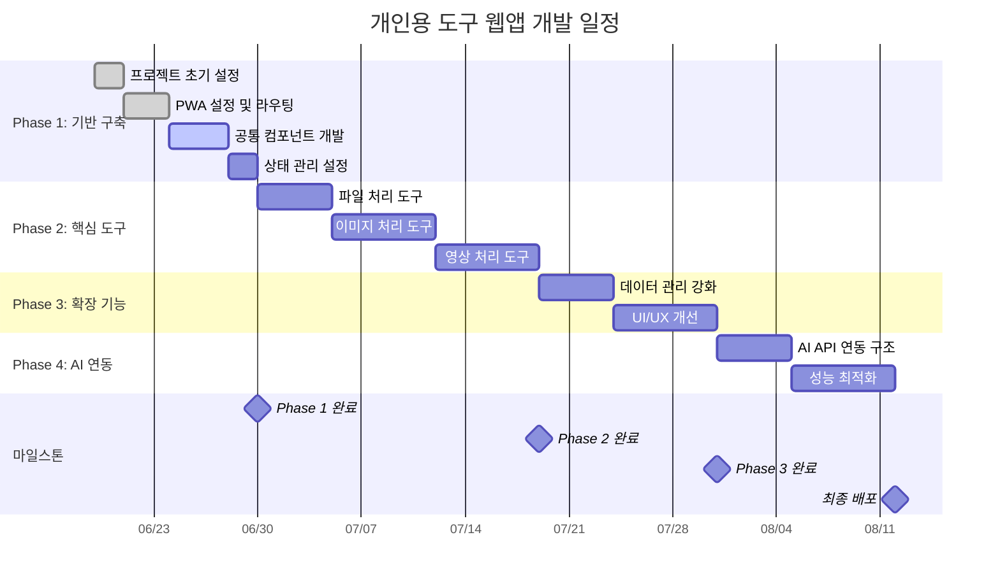
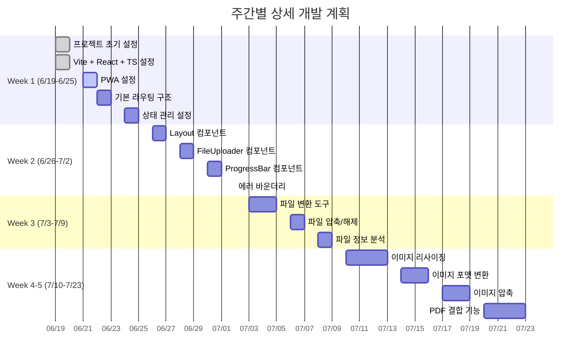
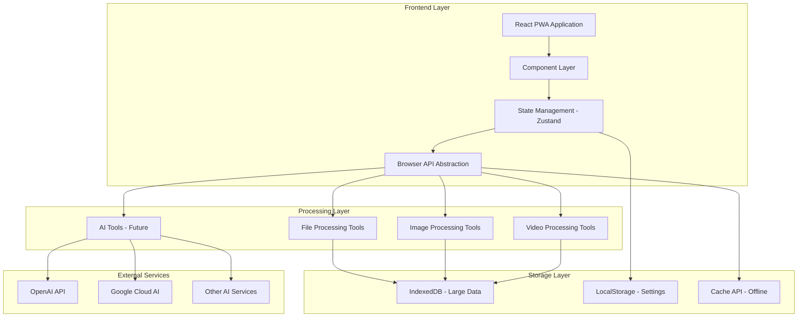
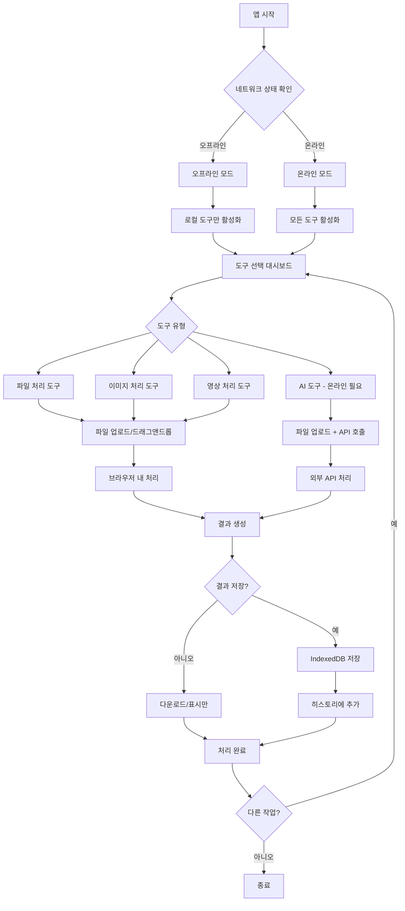
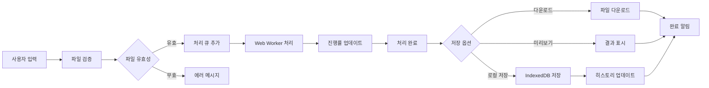

# 개인용 다기능 도구 웹앱 개발 계획

> 최신 업데이트: 2024년 6월 19일

## 목차
- [프로젝트 개요](#프로젝트-개요)
- [개발 일정](#개발-일정)
- [주요 기능](#주요-기능)
- [시스템 아키텍처](#시스템-아키텍처)
- [기술 스택](#기술-스택)
- [개발 단계별 계획](#개발-단계별-계획)
- [서비스 플로우](#서비스-플로우)
- [프로젝트 구조](#프로젝트-구조)
- [배포 전략](#배포-전략)
- [개발 가이드라인](#개발-가이드라인)

## 프로젝트 개요

### 목적
개인적으로 자주 사용하는 다양한 도구들을 웹 환경에서 편리하게 접근할 수 있도록 통합한 PWA(Progressive Web App)

### 핵심 특징
- **오프라인 우선**: 인터넷 연결 없이도 대부분의 기능 사용 가능
- **로컬 처리**: 개인정보 보호를 위한 클라이언트 사이드 처리
- **확장 가능**: 새로운 도구를 쉽게 추가할 수 있는 플러그인 아키텍처
- **반응형**: 데스크톱과 모바일 모두 지원
- **빠른 성능**: 코드 분할과 최적화를 통한 빠른 로딩

## 개발 일정

### 전체 일정 (Gantt Chart)



### 주간별 상세 계획



## 주요 기능

### 1차 개발 기능
#### 파일 처리 도구
- 텍스트 파일 변환 (CSV ↔ JSON ↔ XML)
- 파일 압축/해제 (ZIP)
- 파일 정보 분석 및 메타데이터 추출

#### 이미지 처리 도구
- 이미지 리사이징/회전/크롭
- 포맷 변환 (PNG, JPG, WebP, etc.)
- 이미지 압축 및 최적화
- 여러 이미지를 PDF로 결합

#### 영상 처리 도구
- 영상에서 음성 추출
- 영상 포맷 변환
- 영상 압축
- 기본 영상 편집 (자르기, 합치기)

### 2차 개발 기능 (확장)
#### AI 연동 도구
- OpenAI API 연동 (텍스트 처리, 이미지 생성)
- Google Cloud AI 서비스 연동
- 로컬 AI 모델 (TensorFlow.js) 활용

#### 고급 기능
- 배치 처리 지원
- 사용자 정의 워크플로우
- 히스토리 및 즐겨찾기 관리

## 시스템 아키텍처

### 전체 아키텍처 구조



### 기술 스택 구조

```
┌─────────────────────────────────────────────────────────┐
│                 Frontend (React PWA)                    │
├─────────────────────────────────────────────────────────┤
│  ┌─────────────┐ ┌─────────────┐ ┌─────────────┐       │
│  │ 파일 처리   │ │ 이미지 처리 │ │ 영상 처리   │       │
│  │ 도구        │ │ 도구        │ │ 도구        │       │
│  └─────────────┘ └─────────────┘ └─────────────┘       │
│  ┌─────────────────────────────────────────────────────┐ │
│  │              AI 도구 (추후 확장)                   │ │
│  └─────────────────────────────────────────────────────┘ │
│  ┌─────────────────────────────────────────────────────┐ │
│  │                공통 UI 컴포넌트                     │ │
│  └─────────────────────────────────────────────────────┘ │
│  ┌─────────────────────────────────────────────────────┐ │
│  │           브라우저 API 추상화 레이어                │ │
│  │  File API | Canvas API | Web Workers | IndexedDB   │ │
│  └─────────────────────────────────────────────────────┘ │
└─────────────────────────────────────────────────────────┘
              ↓ (오프라인 우선)    ↓ (온라인 필요시)
┌─────────────────────────────┐  ┌─────────────────────────┐
│     로컬 스토리지 계층       │  │    외부 API 서비스      │
│ - IndexedDB (대용량 데이터) │  │ - OpenAI API           │
│ - LocalStorage (설정)       │  │ - Google Cloud AI      │
│ - Cache API (오프라인)      │  │ - 기타 AI 서비스       │
└─────────────────────────────┘  └─────────────────────────┘
```

## 기술 스택

### 핵심 기술
- **Frontend Framework**: React 18 + TypeScript
- **Build Tool**: Vite
- **PWA**: Service Worker + Web App Manifest
- **State Management**: Zustand
- **Routing**: React Router DOM
- **Styling**: CSS Modules + CSS Variables

### 파일/미디어 처리
- **File Handling**: File API, FileReader API
- **Image Processing**: Canvas API, Sharp.js (WebAssembly)
- **Video Processing**: FFmpeg.wasm
- **PDF Generation**: PDF-lib
- **Compression**: JSZip, Pako

### 데이터 저장
- **Large Data**: IndexedDB (Dexie.js)
- **Settings**: LocalStorage
- **Offline Cache**: Cache API

### 외부 연동 (추후)
- **HTTP Client**: Axios
- **AI Services**: OpenAI API, Google Cloud AI
- **Local AI**: TensorFlow.js

## 개발 단계별 계획

### Phase 1: 기반 구축 (2주) ✅ 진행중
```
Week 1 (6/19-6/25):
✅ 프로젝트 초기 설정 (Vite + React + TypeScript)
✅ PWA 설정 (Service Worker, Manifest)
🔄 기본 라우팅 및 레이아웃 구조
⏳ 상태 관리 (Zustand) 설정

Week 2 (6/26-7/2):
⏳ 공통 컴포넌트 개발 (Layout, FileUploader, ProgressBar)
⏳ 브라우저 API 추상화 레이어
⏳ 에러 바운더리 및 로딩 상태 관리
```

### Phase 2: 핵심 도구 개발 (3-4주)
```
Week 3 (7/3-7/9):
- 파일 처리 도구
  * 텍스트 파일 변환 (CSV, JSON, XML)
  * 파일 압축/해제
  * 파일 정보 분석

Week 4-5 (7/10-7/23):
- 이미지 처리 도구
  * 이미지 리사이징/회전/크롭
  * 포맷 변환 (PNG, JPG, WebP)
  * 이미지 압축 및 최적화
  * 이미지를 PDF로 결합

Week 5-6 (7/24-8/6):
- 영상 처리 도구
  * FFmpeg.wasm 통합
  * 영상에서 음성 추출
  * 영상 포맷 변환
  * 영상 압축
```

### Phase 3: 확장 기능 (2-3주)
```
Week 7-8 (8/7-8/20):
- 데이터 관리 강화
  * 히스토리 관리
  * 즐겨찾기 기능
  * 설정 관리
  * 데이터 내보내기/가져오기

Week 8-9 (8/21-9/3):
- UI/UX 개선
  * 다크/라이트 테마
  * 반응형 디자인 완성
  * 키보드 단축키
  * 배치 처리 지원
```

### Phase 4: AI 연동 및 최적화 (2-3주)
```
Week 9-10 (9/4-9/17):
- AI API 연동 구조
  * API 클라이언트 추상화
  * 에러 처리 및 재시도 로직
  * 진행률 표시
  * 비용 추적

Week 10-11 (9/18-10/1):
- 성능 최적화
  * 코드 분할
  * Web Worker 최적화
  * 메모이제이션
  * 번들 크기 최적화
```

## 서비스 플로우

### 사용자 흐름도



### 데이터 흐름도



## 프로젝트 구조

```
src/
├── components/              # 재사용 가능한 컴포넌트
│   ├── common/             # 공통 컴포넌트
│   │   ├── Layout/         # 레이아웃 컴포넌트
│   │   ├── FileUploader/   # 파일 업로드 컴포넌트
│   │   └── ProgressBar/    # 진행률 표시
│   ├── forms/              # 폼 관련 컴포넌트
│   └── ui/                 # 기본 UI 컴포넌트
├── pages/                  # 페이지별 컴포넌트
│   ├── Dashboard/          # 메인 대시보드
│   ├── FileTools/          # 파일 처리 도구
│   ├── ImageTools/         # 이미지 처리 도구
│   ├── VideoTools/         # 영상 처리 도구
│   └── AITools/            # AI 도구 (추후)
├── hooks/                  # 커스텀 훅
│   ├── useFileProcessor.ts # 파일 처리 훅
│   ├── useImageProcessor.ts# 이미지 처리 훅
│   └── useToolRegistry.ts  # 도구 등록 관리
├── utils/                  # 유틸리티 함수
│   ├── fileProcessor.ts    # 파일 처리 유틸
│   ├── imageProcessor.ts   # 이미지 처리 유틸
│   └── videoProcessor.ts   # 영상 처리 유틸
├── services/               # 서비스 레이어
│   ├── api/                # API 클라이언트
│   ├── storage/            # 스토리지 관리
│   └── workers/            # Web Worker 관리
├── stores/                 # 상태 관리
│   ├── appStore.ts         # 전역 앱 상태
│   ├── toolStore.ts        # 도구 관련 상태
│   └── historyStore.ts     # 히스토리 관리
├── types/                  # TypeScript 타입 정의
│   ├── tool.ts             # 도구 관련 타입
│   ├── file.ts             # 파일 관련 타입
│   └── api.ts              # API 관련 타입
├── styles/                 # 전역 스타일
│   ├── globals.css         # 전역 CSS
│   ├── variables.css       # CSS 변수
│   └── themes/             # 테마 관련
├── assets/                 # 정적 자원
└── workers/                # Web Worker 파일
    ├── fileProcessor.worker.ts
    ├── imageProcessor.worker.ts
    └── videoProcessor.worker.ts
```

## 배포 전략

### 배포 플랫폼: Vercel
- **이유**: React에 최적화, 자동 배포, 무료 플랜 충분
- **도메인**: 사용자 정의 도메인 설정 가능
- **환경**: Production, Preview 환경 자동 생성

### 배포 설정
```json
// vercel.json
{
  "builds": [
    {
      "src": "package.json", 
      "use": "@vercel/static-build"
    }
  ],
  "routes": [
    {
      "src": "/(.*)",
      "dest": "/index.html"
    }
  ],
  "headers": [
    {
      "source": "/sw.js",
      "headers": [
        {
          "key": "Cache-Control",
          "value": "public, max-age=0, must-revalidate"
        }
      ]
    }
  ]
}
```

### PWA 최적화
- Service Worker로 오프라인 캐싱
- App Shell 아키텍처
- 점진적 로딩
- 백그라운드 동기화

## 개발 가이드라인

### 코딩 컨벤션
- **파일명**: PascalCase (컴포넌트), camelCase (유틸리티)
- **변수명**: camelCase, 명확한 의미 전달
- **상수**: SCREAMING_SNAKE_CASE
- **인터페이스**: PascalCase with I prefix

### 성능 고려사항
- 코드 분할로 초기 로딩 시간 최소화
- Web Worker로 메인 스레드 블로킹 방지
- 메모이제이션으로 불필요한 재계산 방지
- 이미지 lazy loading

### 보안 고려사항
- 클라이언트 사이드 처리로 데이터 보호
- API 키는 환경 변수로 관리
- HTTPS 통신 강제
- XSS 방지를 위한 입력 검증

### 테스트 전략
- 단위 테스트: 유틸리티 함수 및 컴포넌트
- 통합 테스트: 도구별 처리 플로우
- E2E 테스트: 주요 사용자 시나리오

---

**문서 버전**: v1.0  
**마지막 업데이트**: 2025년 6월 19일  
**작성자**: 박재석  
**검토자**: 프로젝트 관리자 
