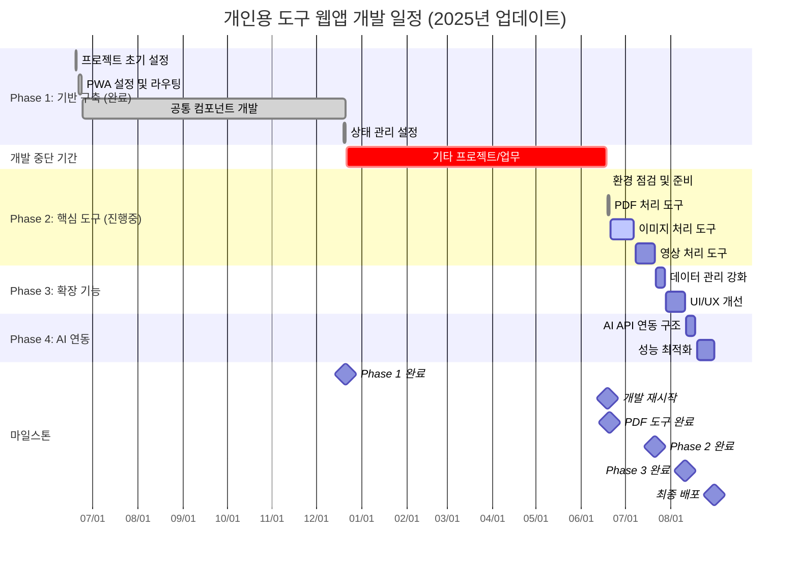
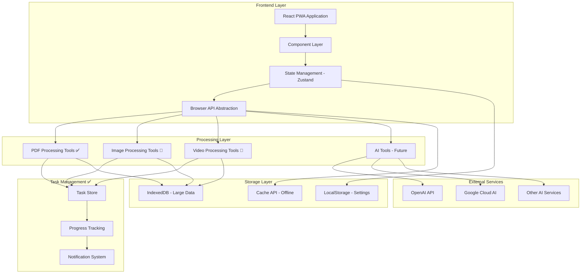
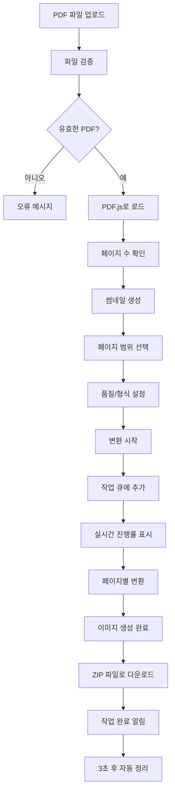
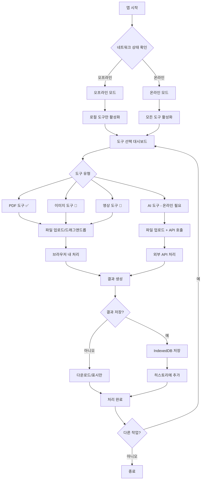
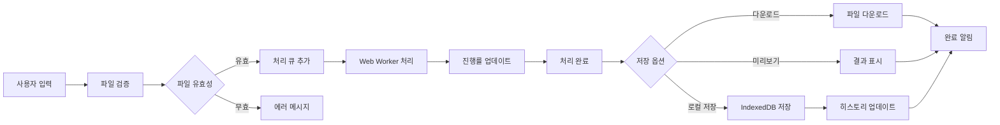

# 개인용 다기능 도구 웹앱 개발 계획

> 최신 업데이트: 2025년 6월 20일

## 목차
- [프로젝트 개요](#프로젝트-개요)
- [개발 현황](#개발-현황)
- [개발 일정](#개발-일정)
- [주요 기능](#주요-기능)
- [시스템 아키텍처](#시스템-아키텍처)
- [기술 스택](#기술-스택)
- [개발 단계별 계획](#개발-단계별-계획)
- [서비스 플로우](#서비스-플로우)
- [프로젝트 구조](#프로젝트-구조)
- [배포 전략](#배포-전략)
- [개발 가이드라인](#개발-가이드라인)

## 프로젝트 개요

### 목적
개인적으로 자주 사용하는 다양한 도구들을 웹 환경에서 편리하게 접근할 수 있도록 통합한 PWA(Progressive Web App)

### 핵심 특징
- **오프라인 우선**: 인터넷 연결 없이도 대부분의 기능 사용 가능
- **로컬 처리**: 개인정보 보호를 위한 클라이언트 사이드 처리
- **확장 가능**: 새로운 도구를 쉽게 추가할 수 있는 플러그인 아키텍처
- **반응형**: 데스크톱과 모바일 모두 지원
- **빠른 성능**: 코드 분할과 최적화를 통한 빠른 로딩

## 개발 현황

### 🎯 현재 상태: Phase 2 진행 중 - PDF 도구 완성

#### ✅ Phase 1 완료 사항 (2024.12.21)
- **프로젝트 기반 구축**
  - ✅ Vite + React + TypeScript 프로젝트 설정
  - ✅ 폴더 구조 및 의존성 설치 완료
  - ✅ PWA 설정 (Service Worker, Manifest, 아이콘)
  - ✅ 기본 라우팅 구조 (React Router)
  - ✅ 상태 관리 시스템 (Zustand)

- **UI/UX 기본 구조**
  - ✅ Layout 컴포넌트 (헤더, 네비게이션, 푸터)
  - ✅ 반응형 네비게이션 (활성 메뉴 하이라이트)
  - ✅ 온라인/오프라인 상태 표시
  - ✅ 라이트/다크 테마 토글 기능
  - ✅ PWA 설치 버튼 구현

- **개발 환경 최적화**
  - ✅ TypeScript 타입 정의 (common, tool, PWA)
  - ✅ CSS 시스템 (variables, globals, utility classes)
  - ✅ 파비콘 및 PWA 아이콘 설정
  - ✅ 오류 해결 (import 경로, deprecated 메타태그)

#### 🚀 Phase 2 현재 진행 상황 (2025.6.19~6.20)
- **개발 재시작 및 환경 점검**: ✅ 완료
  - ✅ 의존성 업데이트 및 보안 취약점 해결
  - ✅ 기존 기능 테스트 및 검증
  - ✅ 개발 환경 재설정

- **PDF 처리 도구**: ✅ 완료 (6월 20일)
  - ✅ PDF → 이미지 변환 (PNG, JPG, WebP)
  - ✅ 다중 파일 동시 처리
  - ✅ 페이지 범위 선택 (슬라이더/직접 입력)
  - ✅ 품질 설정 (중품질, 고품질, 최고품질)
  - ✅ 실시간 썸네일 미리보기
  - ✅ 진행률 표시 및 작업 관리
  - ✅ 드래그앤드롭 업로드
  - ✅ 반응형 UI/UX 완성

- **작업 관리 시스템**: ✅ 완료
  - ✅ TaskStore 상태 관리 시스템
  - ✅ 실시간 진행률 추적
  - ✅ 작업 완료/오류 처리
  - ✅ 자동 작업 정리 (3초 후)
  - ✅ 작업 상세보기 토글 기능

#### 🔄 다음 단계: Phase 2 계속 - 이미지 및 영상 도구
- **이미지 처리 도구** (우선순위 2) - 6월 21일 시작 예정
- **영상 처리 도구** (우선순위 3) - 7월 초 시작 예정

### 전체 진행률: ██████████░░░░░░░░░░ 50%

```
Phase 1 (기초 설정): ████████████████████ 100% ✅
Phase 2 (핵심 도구): ██████████░░░░░░░░░░  50% 🚀 진행중
  - PDF 도구:        ████████████████████ 100% ✅
  - 이미지 도구:     ░░░░░░░░░░░░░░░░░░░░   0% 📝 다음
  - 영상 도구:       ░░░░░░░░░░░░░░░░░░░░   0% 📝 예정
Phase 3 (확장 기능): ░░░░░░░░░░░░░░░░░░░░   0% 
Phase 4 (AI 연동):   ░░░░░░░░░░░░░░░░░░░░   0%
```

## 개발 일정

### 업데이트된 개발 일정 (2025년 6월 20일 기준)



## 주요 기능

### 1차 개발 기능
#### PDF 처리 도구 ✅ 완료 (2025.6.20)
- ✅ PDF → 이미지 변환 (PNG, JPG, WebP)
- ✅ 다중 파일 동시 처리
- ✅ 페이지 범위 선택 (슬라이더/직접 입력)
- ✅ 품질 설정 (중품질, 고품질, 최고품질)
- ✅ 실시간 썸네일 미리보기
- ✅ 진행률 표시 및 작업 관리
- ✅ 드래그앤드롭 업로드

#### 파일 처리 도구 📝 예정
- 텍스트 파일 변환 (CSV ↔ JSON ↔ XML)
- 파일 압축/해제 (ZIP)
- 파일 정보 분석 및 메타데이터 추출

#### 이미지 처리 도구 🚀 다음 (6월 21일 시작)
- 이미지 리사이징/회전/크롭
- 포맷 변환 (PNG, JPG, WebP, etc.)
- 이미지 압축 및 최적화
- 여러 이미지를 PDF로 결합

#### 영상 처리 도구 📝 예정 (7월 초)
- 영상에서 음성 추출
- 영상 포맷 변환
- 영상 압축
- 기본 영상 편집 (자르기, 합치기)

### 2차 개발 기능 (확장)
#### AI 연동 도구
- OpenAI API 연동 (텍스트 처리, 이미지 생성)
- Google Cloud AI 서비스 연동
- 로컬 AI 모델 (TensorFlow.js) 활용

#### 고급 기능
- 배치 처리 지원
- 사용자 정의 워크플로우
- 히스토리 및 즐겨찾기 관리

## 시스템 아키텍처

### 전체 아키텍처 구조



### 기술 스택 구조

```
┌─────────────────────────────────────────────────────────┐
│                 Frontend (React PWA)                    │
├─────────────────────────────────────────────────────────┤
│  ┌─────────────┐ ┌─────────────┐ ┌─────────────┐       │
│  │ PDF 도구 ✅ │ │ 이미지 도구🚀│ │ 영상 도구📝 │       │
│  │ (완성)      │ │ (다음)      │ │ (예정)      │       │
│  └─────────────┘ └─────────────┘ └─────────────┘       │
│  ┌─────────────────────────────────────────────────────┐ │
│  │            작업 관리 시스템 ✅ (완성)                │ │
│  └─────────────────────────────────────────────────────┘ │
│  ┌─────────────────────────────────────────────────────┐ │
│  │              AI 도구 (추후 확장)                   │ │
│  └─────────────────────────────────────────────────────┘ │
│  ┌─────────────────────────────────────────────────────┐ │
│  │                공통 UI 컴포넌트 ✅                  │ │
│  └─────────────────────────────────────────────────────┘ │
│  ┌─────────────────────────────────────────────────────┐ │
│  │           브라우저 API 추상화 레이어                │ │
│  │  File API | Canvas API | Web Workers | IndexedDB   │ │
│  └─────────────────────────────────────────────────────┘ │
└─────────────────────────────────────────────────────────┘
              ↓ (오프라인 우선)    ↓ (온라인 필요시)
┌─────────────────────────────┐  ┌─────────────────────────┐
│     로컬 스토리지 계층       │  │    외부 API 서비스      │
│ - IndexedDB (대용량 데이터) │  │ - OpenAI API           │
│ - LocalStorage (설정)       │  │ - Google Cloud AI      │
│ - Cache API (오프라인)      │  │ - 기타 AI 서비스       │
└─────────────────────────────┘  └─────────────────────────┘
```

## 기술 스택

### 핵심 기술
- **Frontend Framework**: React 18 + TypeScript
- **Build Tool**: Vite
- **PWA**: Service Worker + Web App Manifest
- **State Management**: Zustand
- **Routing**: React Router DOM
- **Styling**: CSS Modules + CSS Variables

### PDF/미디어 처리 ✅ 구현 완료
- **PDF Processing**: PDF.js (Mozilla)
- **Canvas Rendering**: HTML5 Canvas API
- **File Handling**: File API, FileReader API
- **Image Export**: Canvas.toBlob(), FileSaver.js
- **Progress Tracking**: Custom Task Management System

### 파일/미디어 처리 📝 예정
- **Image Processing**: Canvas API, Sharp.js (WebAssembly)
- **Video Processing**: FFmpeg.wasm
- **PDF Generation**: PDF-lib
- **Compression**: JSZip, Pako

### 데이터 저장
- **Large Data**: IndexedDB (Dexie.js)
- **Settings**: LocalStorage
- **Offline Cache**: Cache API

### 외부 연동 (추후)
- **HTTP Client**: Axios
- **AI Services**: OpenAI API, Google Cloud AI
- **Local AI**: TensorFlow.js

## 개발 단계별 계획

### Phase 1: 기반 구축 ✅ 완료 (2024.12.21)
```
✅ 프로젝트 초기 설정 (Vite + React + TypeScript)
✅ PWA 설정 (Service Worker, Manifest)
✅ 기본 라우팅 및 레이아웃 구조
✅ 상태 관리 (Zustand) 설정
✅ 공통 컴포넌트 개발 (Layout, PWAInstallButton)
✅ 브라우저 API 추상화 준비
✅ 온라인/오프라인 상태 관리
✅ 테마 시스템 (라이트/다크)
✅ 반응형 네비게이션
```

### ✅ 개발 재시작 완료 (2025.6.19~6.20)
```
✅ 현재 상태 점검 및 의존성 업데이트
✅ 개발 환경 재설정 및 테스트
✅ PDF 처리 도구 완전 구현
✅ 작업 관리 시스템 구축
✅ 실시간 진행률 추적 시스템
✅ UI/UX 개선 및 반응형 대응
```

### Phase 2: 핵심 도구 개발 🚀 진행중 (50% 완료)
```
✅ PDF 처리 도구 (6/19-6/20) - 완료
  * PDF → 이미지 변환 (PNG, JPG, WebP)
  * 다중 파일 처리 시스템
  * 페이지 범위 선택 (슬라이더/직접 입력)
  * 품질 설정 및 형식 선택
  * 실시간 썸네일 미리보기
  * 진행률 표시 및 작업 관리
  * 드래그앤드롭 업로드

🚀 이미지 처리 도구 (6/21-7/7) - 다음
  * 이미지 업로드 및 미리보기 시스템
  * Canvas API 활용 이미지 편집
  * 이미지 리사이징/회전/크롭 기능
  * 포맷 변환 (PNG, JPG, WebP, AVIF)
  * 이미지 압축 및 최적화
  * 여러 이미지를 PDF로 결합

📝 영상 처리 도구 (7/8-7/21) - 예정
  * 영상 파일 업로드 및 정보 표시
  * FFmpeg.wasm 통합 및 최적화
  * 영상에서 음성 추출 (MP3, WAV)
  * 영상 포맷 변환 (MP4, WebM, AVI)
  * 영상 압축 및 품질 조절
  * 기본 영상 편집 (자르기, 합치기)
```

### Phase 3: 확장 기능 (7월 22일~)
```
Week 5-6 (7/22-8/11):
- 데이터 관리 강화
  * 처리 히스토리 관리 시스템
  * 즐겨찾기 및 북마크 기능
  * 설정 관리 UI 개선
  * 데이터 내보내기/가져오기
  * 사용 통계 및 분석

- UI/UX 개선
  * 배치 처리 지원 (여러 파일 동시 처리)
  * 키보드 단축키 시스템
  * 진행률 및 성능 모니터링
  * 접근성 개선 (ARIA, 키보드 네비게이션)
  * 애니메이션 및 마이크로 인터랙션
```

### Phase 4: AI 연동 및 최적화 (8월 12일~)
```
Week 7-8 (8/12-8/31):
- AI API 연동 구조
  * API 클라이언트 추상화 레이어
  * OpenAI API 연동 (텍스트 처리, 이미지 생성)
  * Google Cloud AI 서비스 연동
  * 에러 처리 및 재시도 로직
  * API 사용량 및 비용 추적 시스템

- 성능 최적화 및 마무리
  * 코드 분할 최적화 (Route-based + Component-based)
  * Web Worker 성능 개선
  * 메모리 사용량 최적화
  * 번들 크기 최적화 (Tree Shaking, Dynamic Import)
  * 최종 배포 및 도메인 설정
```

### 🎯 다음 즉시 수행할 작업 (2025.6.21)

#### 1. 이미지 처리 도구 개발 시작
```bash
# 이미지 처리 관련 라이브러리 설치
npm install canvas sharp-wasm

# 이미지 도구 컴포넌트 구조 생성
mkdir -p src/pages/ImageTools/components
mkdir -p src/pages/ImageTools/services
```

#### 2. 이미지 도구 기능 명세
- 이미지 업로드 (드래그앤드롭, 다중 선택)
- 실시간 미리보기 및 편집
- 리사이징 (픽셀, 퍼센트, 비율 유지)
- 회전 및 플립
- 크롭 기능
- 포맷 변환 (PNG, JPG, WebP, AVIF)
- 압축 및 품질 조절
- 배치 처리 지원

#### 3. 작업 관리 시스템 확장
- 이미지 처리 작업 타입 추가
- 진행률 추적 시스템 확장
- 메모리 사용량 모니터링

## 서비스 플로우

### PDF 처리 플로우 ✅ 구현 완료



### 사용자 흐름도



### 데이터 흐름도



## 프로젝트 구조

```
src/
├── components/              # 재사용 가능한 컴포넌트
│   ├── common/             # 공통 컴포넌트
│   │   ├── Layout/         # ✅ 레이아웃 컴포넌트
│   │   ├── TaskSystem/     # ✅ 작업 관리 시스템
│   │   └── PWAUpdatePrompt/ # ✅ PWA 업데이트 프롬프트
│   ├── forms/              # 폼 관련 컴포넌트
│   └── ui/                 # 기본 UI 컴포넌트
├── pages/                  # 페이지별 컴포넌트
│   ├── Dashboard/          # ✅ 메인 대시보드
│   ├── PdfTools/           # ✅ PDF 처리 도구 (완성)
│   │   └── PdfToImage/     # ✅ PDF → 이미지 변환
│   ├── ImageTools/         # 🚀 이미지 처리 도구 (다음)
│   ├── VideoTools/         # 📝 영상 처리 도구 (예정)
│   └── AITools/            # AI 도구 (추후)
├── hooks/                  # 커스텀 훅
│   ├── usePWA.ts          # ✅ PWA 관련 훅
│   ├── useFileProcessor.ts # 📝 파일 처리 훅 (예정)
│   └── useImageProcessor.ts# 🚀 이미지 처리 훅 (다음)
├── utils/                  # 유틸리티 함수
├── services/               # 서비스 레이어
│   ├── api/                # API 클라이언트
│   ├── storage/            # 스토리지 관리
│   └── workers/            # Web Worker 관리
├── stores/                 # 상태 관리
│   ├── appStore.ts         # ✅ 전역 앱 상태
│   ├── toolStore.ts        # ✅ 도구 관련 상태
│   └── taskStore.ts        # ✅ 작업 관리 상태
├── types/                  # TypeScript 타입 정의
│   ├── common.ts           # ✅ 공통 타입
│   ├── tool.ts             # ✅ 도구 관련 타입
│   ├── task.ts             # ✅ 작업 관련 타입
│   └── pwa.ts              # ✅ PWA 타입
├── styles/                 # 전역 스타일
│   ├── globals.css         # ✅ 전역 CSS
│   ├── variables.css       # ✅ CSS 변수
│   └── themes/             # 테마 관련
├── assets/                 # 정적 자원
└── workers/                # Web Worker 파일
```

## 배포 전략

### 배포 플랫폼: Vercel
- **이유**: React에 최적화, 자동 배포, 무료 플랜 충분
- **도메인**: 사용자 정의 도메인 설정 가능
- **환경**: Production, Preview 환경 자동 생성

### 배포 설정
```json
// vercel.json
{
  "builds": [
    {
      "src": "package.json", 
      "use": "@vercel/static-build"
    }
  ],
  "routes": [
    {
      "src": "/(.*)",
      "dest": "/index.html"
    }
  ],
  "headers": [
    {
      "source": "/sw.js",
      "headers": [
        {
          "key": "Cache-Control",
          "value": "public, max-age=0, must-revalidate"
        }
      ]
    }
  ]
}
```

### PWA 최적화
- Service Worker로 오프라인 캐싱
- App Shell 아키텍처
- 점진적 로딩
- 백그라운드 동기화

## 개발 가이드라인

### 코딩 컨벤션
- **파일명**: PascalCase (컴포넌트), camelCase (유틸리티)
- **변수명**: camelCase, 명확한 의미 전달
- **상수**: SCREAMING_SNAKE_CASE
- **인터페이스**: PascalCase with I prefix

### 성능 고려사항
- 코드 분할로 초기 로딩 시간 최소화
- Web Worker로 메인 스레드 블로킹 방지
- 메모이제이션으로 불필요한 재계산 방지
- 이미지 lazy loading

### 보안 고려사항
- 클라이언트 사이드 처리로 데이터 보호
- API 키는 환경 변수로 관리
- HTTPS 통신 강제
- XSS 방지를 위한 입력 검증

### 테스트 전략
- 단위 테스트: 유틸리티 함수 및 컴포넌트
- 통합 테스트: 도구별 처리 플로우
- E2E 테스트: 주요 사용자 시나리오

---


